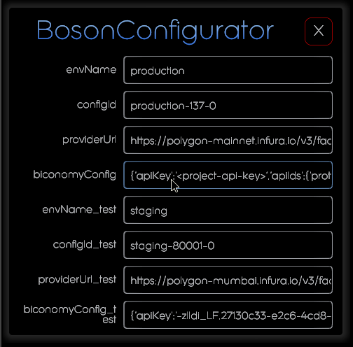

[](https://bosonprotocol.io)

< [Boson Protocol Metaverse Toolkit - Decentraland Library](../README.md)

# Configure the Meta-transactions Relay using Biconomy

## Biconomy Dashboard

The Biconomy Dashboard allows you to define the configuration used by your dApp to relay mets-transactions.

Refer to Biconomy Official Documentation: https://docs-gasless.biconomy.io/guides/biconomy-dashboard

The configuration required to support meta-transactions with Boson Protocol includes:
- an ApiKey, used to connect to the Biconomy API
- a specific ApiId for each method of each smart contract being called with meta-transactions.
  
  With Boson Protocol, the followings methods of the following contracts are called with meta-transactions:
   - Boson Protocol (Diamond) contract (all protocol interactions):
     - `executeMetaTransaction()` method
   - Each supported ERC20 token (required to approve user payments)
     - `executeMetaTransaction()` method

To create such a configuration on Biconomy:
- First, you need to create a dApp in the Dashboard
- Then, you need to register the smart contracts you want to operate with:
  - Boson Protocol diamond contract (see https://github.com/bosonprotocol/boson-protocol-contracts/tree/main/addresses)
  - Each ERC20 token you want to support with Boson Protocol, on the targeted blockchain (for instance, [Mapped Tokens on Polygon](https://mapper.polygon.technology))
  
- Next, for each of these contracts and for their methods your dApp is going to operate with (here only `executeMetaTransaction()`), you need to create an ApiId
  
- Finally you need to check the Gas Balance of your dApp, so that the transactions fees can be paid. If needed, you have to deposit some funds (in native currency of the targeted blockchain, for instance MATIC on Polygon)

## DCL-Edit BosonConfigurator

Once you have created the configuration for your dApp in Biconomy Dashboard, you have to inject it in the Boson Core-SDK.

Here is the format required by the DCL-Edit BosonConfigurator component:

```
{'apiKey':'<project-api-key>','apiIds':{'protocol':{'method':'executeMetaTransaction','apiId':'<project-protocol-api-id>'},'tokens':[{'name':'boson','address':'<boson-protocol-diamond-address>','method':'executeMetaTransaction','apiId':'<project-boson-token-api-id>'},{'name':'weth','address':'<boson-token-address>','method':'executeMetaTransaction','apiId':'<project-weth-token-api-id>'},{'name':'usdc','address':'<weth-token-address>','method':'executeMetaTransaction','apiId':'<project-usdc-token-api-id>'},{'name':'dai','address':'<usdc-token-address>','method':'executeMetaTransaction','apiId':'<project-dai-token-api-id>'},{'name':'usdt','address':'<dai-token-address>','method':'executeMetaTransaction','apiId':'<project-usdt-token-api-id>'}]}}
```
where `<project-api-key>` is your dApp ApiKey, `<project-protocol-api-id>` is the ApiId for the Boson Protocol diamond contract whose address is `<boson-protocol-diamond-address>`, and `<project-*-token-api-id>` are the ApiIds created for each ERC20 token whose address are `<*-token-address>`.

### Configuration per blockchain in DCL-Edit
As it's useful to have a testing environment as a stage before production, you will probably need 2 configurations, one for your production scene (mainnet) and another one for the testing configuration (testnet).

The configuration for the production/mainnet blockchain (for instance Polygon) shall be assigned to the `biconomyConfig` property of the BosonConfigurator component in DCL-Edit, while the one for the testnet (for instance Mumbai) shall be assigned to the `biconomyConfig_test` property


For testing purpose, the following configuration can be used on Mumbai network (to be set to the `biconomyConfig_test` property).
```
{'apiKey':'-zIIdi_LF.27130c33-e2c6-4cd8-9419-fb053c4963cf','apiIds':{'protocol':{'method':'executeMetaTransaction','apiId':'fc2b3fb0-ae4b-405e-970e-ddcb0643350a'},'tokens':[{'name':'boson','address':'0x1f5431e8679630790e8eba3a9b41d1bb4d41aed0','method':'executeMetaTransaction','apiId':'7ab660a5-e337-49d7-ad1b-fd688612c943'},{'name':'weth','address':'0xa6fa4fb5f76172d178d61b04b0ecd319c5d1c0aa','method':'executeMetaTransaction','apiId':'02e4ac0a-2437-47d0-9ac2-67c94f0e313f'},{'name':'usdc','address':'0xe6b8a5cf854791412c1f6efc7caf629f5df1c747','method':'executeMetaTransaction','apiId':'b57012d0-3437-4780-a05c-51d956fabf98'}]}}
```
 For production (Polygon mainnet), you have to register to Biconomy and create your own configuration, and set it to the `biconomyConfig` property.