[](https://bosonprotocol.io)

< [Boson Protocol Metaverse Toolkit - Decentraland Library](../README.md)

# Use Boson Protocol with [DCL Edit](https://dcl-edit.com)

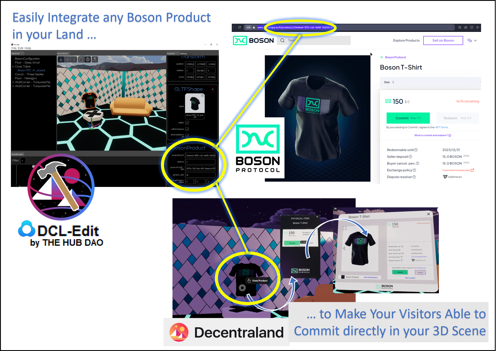

- The [**@bosonprotocol/boson-dcl**](https://npm.io/package/@bosonprotocol/boson-dcl) library allows to use Boson Protocol in a Decentraland scene. Doing so, you can build a completely new shopping experience to your users.
- [**DCL Edit**](https://dcl-edit.com) makes scene building an easy and user-friendly process, allowing to place and manipulate 3D objets just like in any other state-of-the-art game engine.
- Combining **@bosonprotocol/boson-dcl** with **DCL-Edit**, you can easily create a 3D scene with objects which can be clicked to commit to some Boson Protocol products/offers.

## Prerequisites

- register a Boson Seller account in the [Boson Protocol Marketplace](https://bosonapp.io)
- create some Boson Protocol products in the marketplace

### Notes: 
- when using the [Boson Protocol Marketplace](https://bosonapp.io), you can choose to use Boson Protocol on [Ethereum](https://ethereum.org/en/) or on [Polygon](https://polygon.technology/polygon-pos).
  Your choice between Ethereum and Polygon must consider different points, detailed [here](./ethereum-or-polygon.md).
- it is also possible to use a test environment to create your products and discover Boson Protocol (https://interface-staging.on.fleek.co), in which case the testnet blockchains will be, respectively Goerli and Polygon Mumbai.


## DCL-Edit installation

Please refer to [DCL-Edit Install Instructions](https://dcl-edit.com/install-guide)

## Edit the scene with DCL-Edit

With DCL-Edit, you can place and manipulate objects in your scene just like in any other state-of-the-art game engine.

Launch DCL-Edit from your scene folder:
```
dcl-edit
```

### Note:
- The complete example code created for your scene at this stage (in `./src/game.ts`) can be removed, as you won't probably use it.

  Instead, you will be asked to call the SceneFactory method generated by DCL-Edit when you'll save your scene (details given in the next steps).

### Add a BosonConfigurator component

This component is required to initialize the **@bosonprotocol/boson-dcl** library with the correct configuration.

It must be unique to your scene.

Even if any entity of any kind could fit, ideally, you should create an Empty Entity, for instance called "BosonConfigurator" (the chosen name doesn't have any impact)

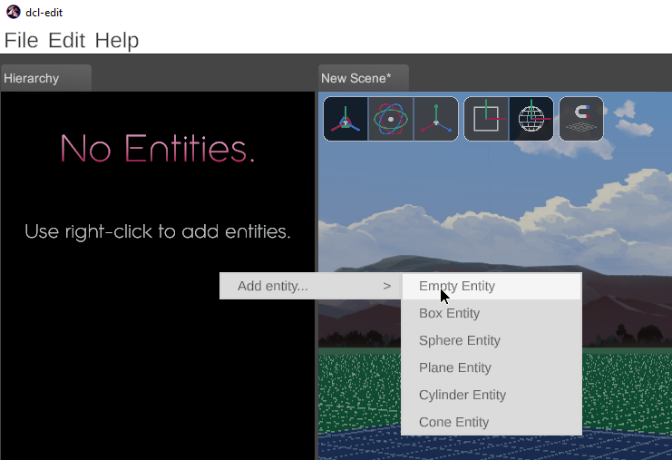

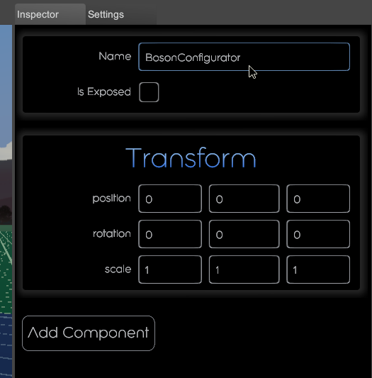

Then, click **Add Component** and select **BosonProtocol > BosonConfigurator**

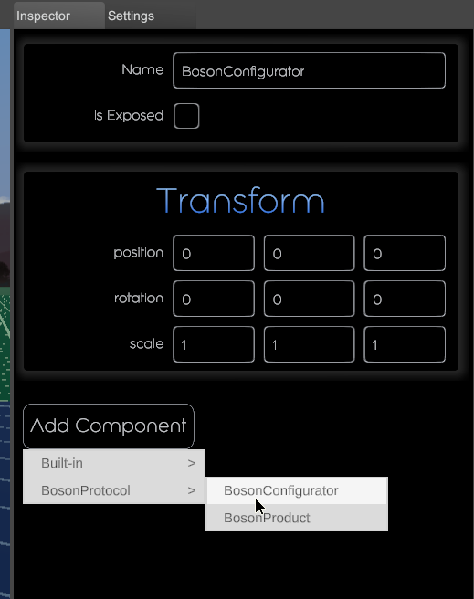

And configure the component's properties, as follow:
- **envName**: is the Boson environment used in your scene when users connect their wallet on Ethereum, which is the standard case in Decentraland. You should set it to `production`.
- **configId**: is the Boson configuration activated in your scene. This depends on which blockchain you decide to create your Boson products (see [Ethereum or Polygon](./ethereum-or-polygon.md))
  - on Polygon: `production-137-0`
  - on Ehtereum: `production-1-0`
- **providerUrl**: is the endpoint to an RPC Node on the blockchain you address (Polygon or Ethereum). If you don't have such endpoints, you can subscribe to [Infura](https://www.infura.io/networks) (a free-plan is available) or any other [chain node provider](https://101blockchains.com/blockchain-node-providers-in-web3/). For instance:
  - on Polygon: `https://polygon-mainnet.infura.io/v3/<your-api-key>`,
  - on Ethereum: `https://mainnet.infura.io/v3/<your-api-key`.
- **biconomyConfig**: is the Biconomy configuration required to activate the meta-transactions relay for Boson Protocol.
  - on Polygon: see [Biconomy configuration](./biconomy.md).
    If you don't set any Biconomy Configuration yet, you will be able to run your scene in preview mode only. However, once deployed on Decentraland, interacting with the Boson Protocol without meta-transactions won't be possible.
  - on Ethereum: you probably don't need to use meta-transactions, so you can let the field empty. If not sure about which chain to choose, please refer to [Ethereum or Polygon](./ethereum-or-polygon.md).
- **envName_test**: is the Boson environment used in your scene when users connect their wallet on a chain different from Ethereum, which means the scene is not in a production environment. You should set this property to the `staging` value.
- **configId_test**: is the Boson configuration activated in your scene when users connect their wallet on a chain different from Ethereum. This depends on which blockchain you decide to create your Boson products
  - on Mumbai (Polygon testnet): `staging-80001-0`,
  - on Goerli (Ethereum testnet): `staging-5-0`,
  - or let empty if you don't want to use a test environment.
- **providerUrl_test**: is the endpoint to an RPC Node on the blockchain you address (Mumbai or Goerli). For instance:
  - on Mumbai: `https://polygon-mumbai.infura.io/v3/<your-api-key>`,
  - on Goerli: `https://goerli.infura.io/v3/<your-api-key>`,
  - or let empty if you don't want to use a test environment.
- **biconomyConfig_test**: is the Biconomy configuration required to activate the meta-transactions relay for Boson Protocol in the test environment.
  - on Mumbai: see [Biconomy configuration](./biconomy.md),
  - on Goerli: you probably don't need to use Biconomy.

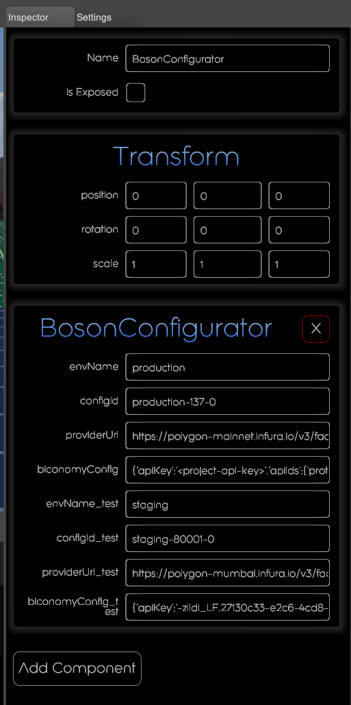

### Identify the Boson Products to be referenced in your scene

Assuming the Boson Products you want to sell in your scene have been created on Boson Protocol, you should be able to find them in the Boson Marketplace:
- [www.bosonapp.io](https://www.bosonapp.io) in the production environment
- [interface-staging.on.fleek.co](https://interface-staging.on.fleek.co) in the test (staging) environment

For instance: [https://www.bosonapp.io/#/products/2/0e4ea4-5f35-ca5-4e68-26d561ac13](https://www.bosonapp.io/#/products/2/0e4ea4-5f35-ca5-4e68-26d561ac13) is the product in the production Boson Marketplace. The sellerId and the productUUID can be found in the URL:
- sellerId: `"2"`
- productUUID: `"0e4ea4-5f35-ca5-4e68-26d561ac13"`
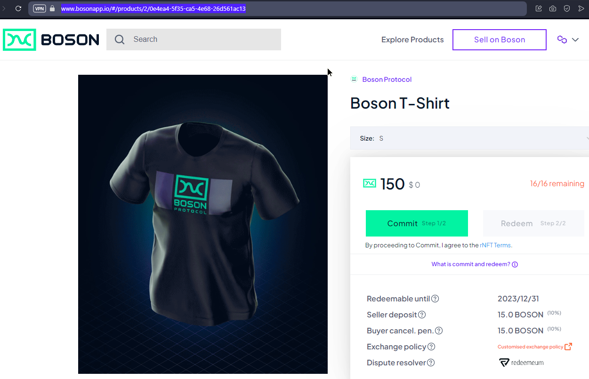

Similarly, [the same product](https://interface-staging.on.fleek.co/#/products/18/3f27e-7d7-fab-4f12-8aebc147fa) has been created in the test (staging) environment, with the following references:
- sellerId: `"18"`
- productUUID: `"3f27e-7d7-fab-4f12-8aebc147fa"`
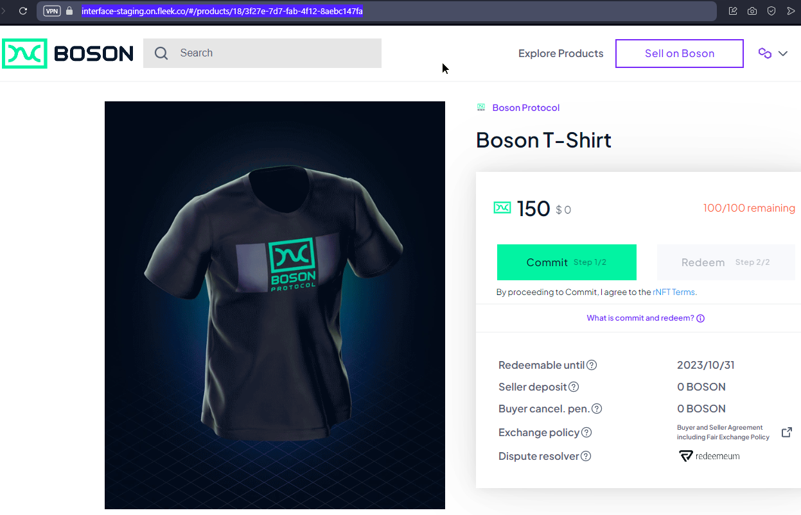

### Add BosonProduct components on 3D objects

Once you have started building your scene with DCL-Edit, and placed some 3D entities representing the Boson Products for sale, add to them a **BosonProduct** component to associate an existing Boson Product.

These objects will be clickable and, when clicked, the Commit Popup will appear to let the user commit to the associated Boson Product.

Practically, 2 products can be associated to an object, one for the production environment (mainnet blockchain) and another one for the test environment (testnet blockchain), as the same product will be differently identified between the 2 environments.

- Within DCL-Edit, select an object, then click **Add Component > BosonProtocol > BosonProduct**.

  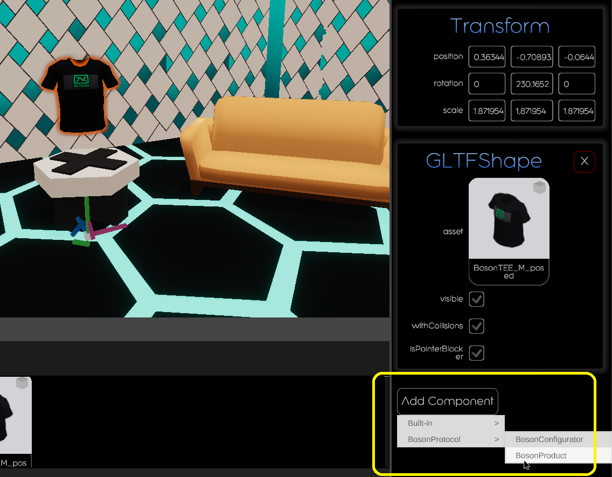

- Set the component properties to associate the object with your Boson Product (seller Id and product UUID), on production and on test environment:
  - **productUUID**: identifies the product created on Boson Protocol in the production environment
  - **sellerId**: identifies the Seller having created the Boson Product in the production environment
  - **productUUID_test**: identifies the product created on Boson Protocol in the test environment
  - **sellerId_test**: identifies the seller having created the Boson Product in the test environment
  - **panelPositionOffset**: sets the position of the Commit panel regarding to the object, shown when the object is clicked by the user. Default value is [0, 0, 0]

  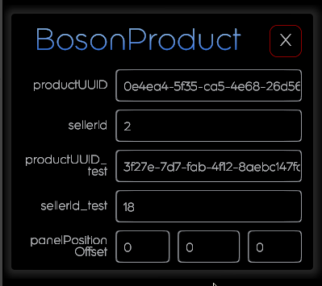

### Save and Run your scene preview

- Save your scene with DCL-Edit
  (be sure you save into the `assets` subfolder)
  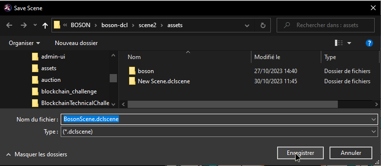

- Check your scene source code (`./src/game.ts`) is calling the SceneFactory method generated by DCL-Edit (*the name of this method depends on the name of your scene, chosen when you've saved it*)
  ```
  // game.ts
  import { SceneFactory } from "dcl-edit/build/scripts/scenes"

  const scene = SceneFactory.createBosonScene()
  ```

- Run the scene preview
  ```shell
  dcl start --web3
  ```
  Ensure you Sign In with your wallet. If connected on Ethereum, the scene is going to run in production environment, otherwise it will use the test environment.

  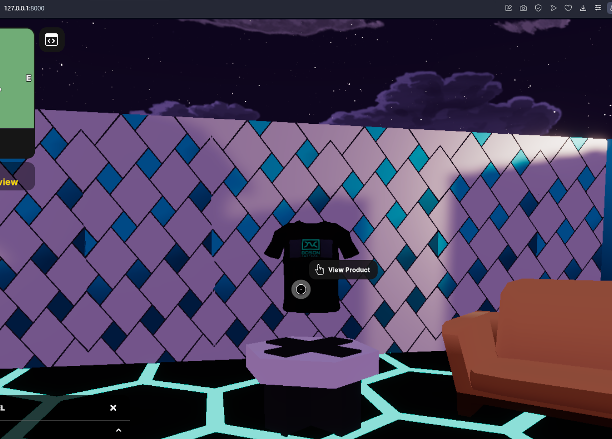

- You should be able to click on objects that have a BosonProduct component. When clicked, the Commit popup opens, show details about the associated Boson Product and allow the user to commit to this offer.
  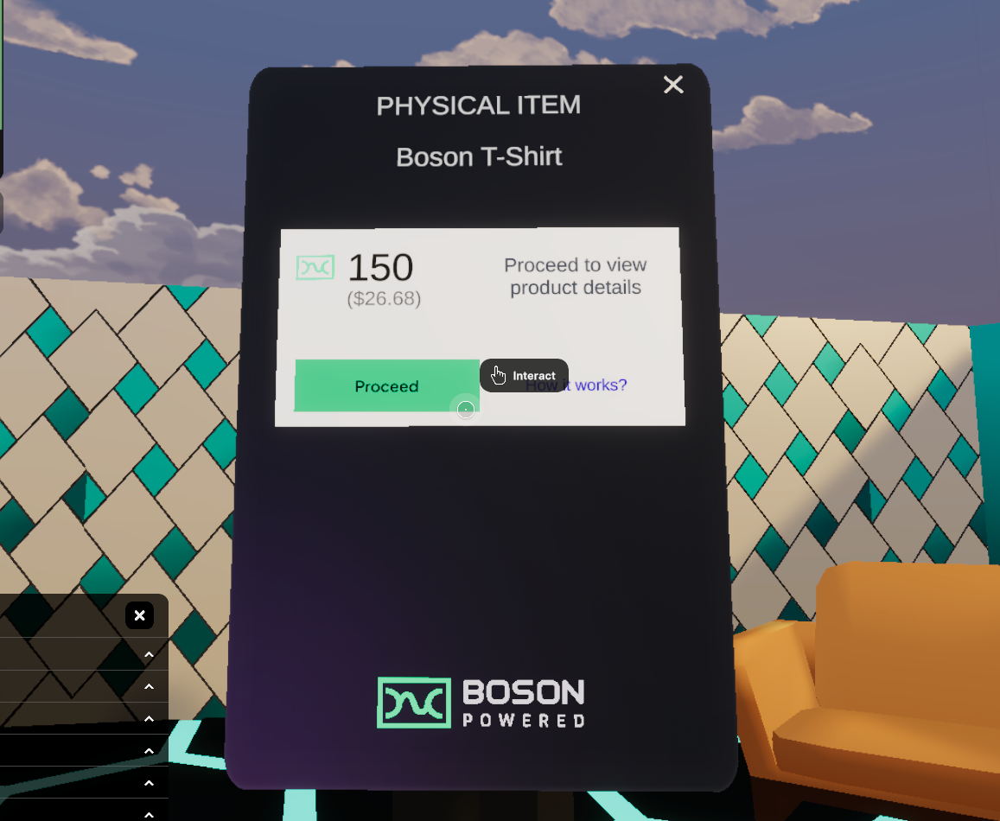
  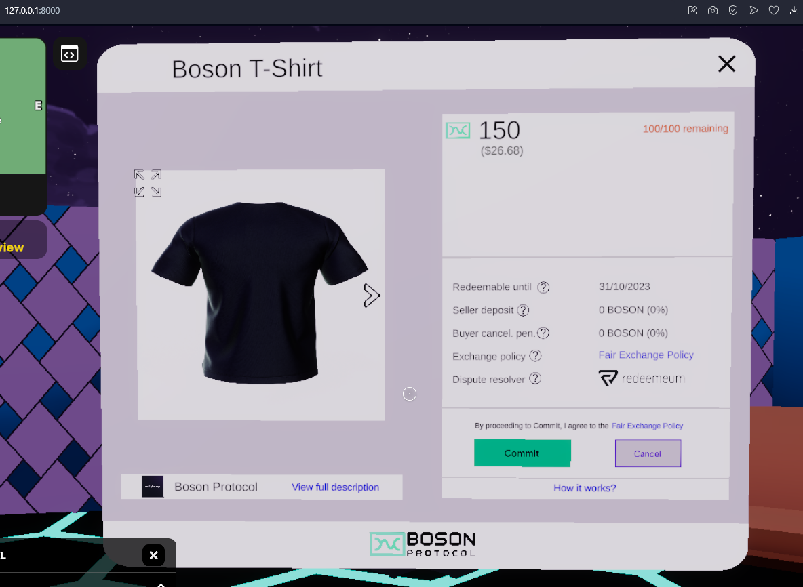